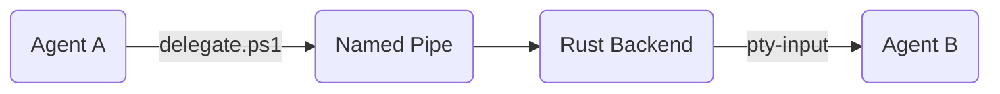

# 🛰️ DidiTerminal
### The Autonomous Multi-Agent Orchestrator Terminal

DidiTerminal is a high-performance Windows-first desktop application designed for seamless, autonomous coordination between multiple AI agents. It transforms a standard terminal environment into a distributed "Agent OS" where specialized agents (Builders, Architects, Testers) collaborate on complex full-stack codebases with production-grade reliability.

---

## 🏗️ Core Architecture & Tech Stack

DidiTerminal is built with a state-of-the-art hybrid architecture that bridges high-level React UI with low-level Rust systems.

*   **Frontend:** React 19 + TypeScript + Vite + Tailwind CSS.
*   **Terminal Engine:** `xterm.js` & **Ghostty (WASM)** with WebGL rendering for high-performance TUI support.
*   **Backend Runtime:** Tauri 2.0 (Rust) providing native Windows API access.
*   **Database:** SQLite (via `tauri-plugin-sql`) for persistent workspace and agent configuration.
*   **PTY Management:** `portable-pty` for spawning and controlling native PowerShell/CMD instances.
*   **Inter-Process Communication (IPC):** A custom **DidiBus** built on Windows Named Pipes (`\\.\pipe\agentbus`) using Tokio.
*   **Local AI Inference:** Integrated `llama-server` sidecar for private, local LLM execution.
*   **Aesthetics:** Modern **Glassmorphism** UI with native Windows Acrylic/Mica support and neural-inspired visual feedback.

---

## 🚀 Key Features

### 🧠 Autonomous Orchestration
- **The Didi Protocol:** Automated workspace scaffolding via `.didi/` directory, providing agents with standardized communication scripts.
- **Orchestration Map (Network Graph):** A real-time visual network of your agent fleet. Drag lines between agents to dispatch tasks and monitor handoff flows.
- **Master Plan (`MASTER_PLAN.md`):** A shared, file-based state machine that ensures agents stay synchronized without burning tokens on long chat histories.

### 🛡️ Reliability & Safety
- **Sentinel Watchdog:** A background monitor that detects hallucination loops or repetitive command failures, automatically injecting corrective prompts.
- **Brainstorming Mode:** A multi-agent consensus protocol where specialized agents (e.g., Security, UI, Backend) debate a solution before execution.
- **Time-Travel Snapshots:** Integrated git-snapshotting that allows the human or the Orchestrator to "rewind" the entire workspace if an agent breaks the build.
- **Human-In-The-Loop (HITL):** A formal approval system for sensitive agent actions, ensuring you retain ultimate control.

### 🖥️ Advanced Productivity Suite
- **Personal Kanban Board:** High-performance, workspace-isolated task management for manual workflows. Persists to a local SQLite database, ensuring your personal todo list stays private between projects.
- **AI-Powered Code Reviewer:** A dedicated panel for real-time code analysis. Track diff stats (+/-) at a glance and use local AI to review changes before committing.
- **Advanced Git GUI:** Full source control management (Stage, Commit, Push/Pull, History) with whitespace-accurate porcelain parsing and deduplicated branch badges.
- **Integrated Browser:** Multi-instance webview for real-time UI/UX debugging. Preview your apps directly alongside your agent terminals.
- **Pro Layout Engine:** Flexible tiling including **Grid**, **Focus**, **Presentation**, **Waterfall**, and **Canvas** mode with a streamlined topbar navigation.

---

## 📖 Step-by-Step Tutorial

### 1. Setup & Launch
- Clone the repository and install dependencies using `npm install`.
- Launch the application with `npm run tauri dev`.
- Ensure **PowerShell** is installed, as DidiTerminal is optimized for Windows-native automation.

### 2. Initializing a Workspace
- Click the **Folder Icon** in the sidebar to select your project directory.
- Click **"Init Didi Protocol"**. This scaffolds the `.didi/` directory:
  - `delegate.ps1`: The bridge to the IPC bus.
  - `context.ps1`: Automated context gathering for agents.
  - `MASTER_PLAN.md`: The shared state file for task tracking.

### 3. Visual Tasking
- Open the **Orchestration Map** (Network icon).
- You can dispatch tasks by simply **dragging a connection** from one agent node to another.
- Right-click agent nodes for "Command & Control" (Inject Hints, Pause, or Force Kill).

### 4. Mastering the Brainstorm
- Stuck on a complex architectural decision? Click the **Brain** icon.
- Select your participants and describe the problem.
- Watch as your agents debate in real-time. Once they reach a consensus, the result is automatically appended to your `MASTER_PLAN.md`.

### 5. Advanced Tiling & Canvas
- Switch between layout modes using the icons in the top bar.
- Use **Focus Mode** to highlight a primary agent while keeping others visible.
- Use **Canvas Mode** to drag terminals and browsers anywhere in a free-form workspace.

### 6. Time-Travel & Git
- DidiTerminal takes a git snapshot every time a task is delegated.
- If an agent makes a mistake, open the **Snapshot Panel** and click **"Rewind"** to restore your workspace instantly.
- Use the **Git Panel** to review changes and commit progress without leaving the app.

### 7. Managing Manual Tasks
- Click the **"My Tasks"** button in the topbar to open your personal Kanban board.
- This board is **workspace-isolated**; tasks you add here will not appear in other projects.
- Drag tasks between columns to track your personal progress alongside your AI agents.

### 8. Code Review & Quality
- Monitor the **Code Review** counter in the topbar (+/-).
- Open the panel to see AI-powered analysis of your current changes before you commit them via the Git panel.

---

## 💡 Best Practices

- **Atomic Tasks:** Keep delegated tasks small and specific.
- **Manual + Auto:** Use the **Personal Kanban** for your own tasks and the **Master Plan** for your agents' tasks.
- **Context is King:** Use `.didi\context` within your prompts to feed agents the latest directory structure and git status.

---

## ⚡ Developer Setup

### Prerequisites
- Node.js (v18+)
- Rust (stable)
- Windows (Optimized for PowerShell)

### Development
```bash
# Install dependencies
npm install

# Run the app in development mode
npm run tauri dev
```

### Building for Release
```bash
npm run tauri build
```

---

## 🛰️ The Didi Protocol IPC
The core of the system is the **DidiBus**. 
1. **Sender:** Runs `delegate.ps1`, which writes a JSON payload to `\\.\pipe\agentbus`.
2. **Rust Backend:** A background Tokio thread listens on the pipe, logs the event, and emits a Tauri event.
3. **Frontend:** React catches the event and writes the payload directly into the `stdin` of the target Xterm instance.



---

## 🚀 Future Roadmap

- **🧬 Codebase-Wide RAG:** Local vector database for semantic search and long-term memory.
- **🏢 DidiCloud Bridge:** Extending the DidiBus over WebSockets for remote GPU coordination.
- **🛡️ Sandboxed Execution:** Docker/WASM isolation for high-risk code execution.
- **🎤 Voice Command Overlay:** Natural language control for the human orchestrator.
- **📦 Didi Skill Marketplace:** Standardized `.didi/skills` registry for DevOps tasks.
