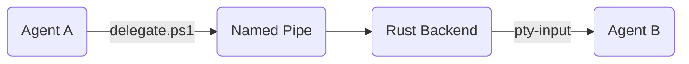

# 🛰️ DidiTerminal
### The Autonomous Multi-Agent Orchestrator Terminal

DidiTerminal is a high-performance Windows-first desktop application designed for seamless, autonomous coordination between multiple AI agents. It transforms a standard terminal environment into a distributed "Agent OS" where specialized agents (Builders, Architects, Testers) collaborate on complex full-stack codebases with production-grade reliability.

---

## 🏗️ Core Architecture & Tech Stack

DidiTerminal is built with a state-of-the-art hybrid architecture that bridges high-level React UI with low-level Rust systems.

*   **Frontend:** React 19 + TypeScript + Vite + Tailwind CSS.
*   **Terminal Engine:** `xterm.js` with WebGL rendering for high-performance TUI support.
*   **Backend Runtime:** Tauri 2.0 (Rust) providing native Windows API access.
*   **PTY Management:** `portable-pty` for spawning and controlling native PowerShell/CMD instances.
*   **Inter-Process Communication (IPC):** A custom **DidiBus** built on Windows Named Pipes (`\\.\pipe\agentbus`) using Tokio.
*   **Local AI Inference:** Integrated `llama-server` sidecar for private, local LLM execution.

---

## 🚀 Key Features

### 🧠 Autonomous Orchestration
- **The Didi Protocol:** Automated workspace scaffolding via `.didi/` directory, providing agents with standardized communication scripts.
- **Master Plan (`MASTER_PLAN.md`):** A shared, file-based state machine that ensures agents stay synchronized without burning tokens on long chat histories.
- **Context Hydration:** A token-efficient snapshot system (`.didi\context`) that feeds agents git status, directory trees, and plan progress.

### 🛡️ Reliability & Safety
- **Sentinel Watchdog:** A background monitor that detects hallucination loops or repetitive command failures, automatically injecting corrective prompts.
- **Time-Travel Rollbacks:** Integrated git-snapshotting that allows the human or the Orchestrator to "rewind" the entire workspace if an agent breaks the build.
- **Brainstorming Mode:** A multi-agent consensus protocol where specialized agents (e.g., Security, UI, Backend) debate a solution before execution.

### 🖥️ Advanced Tiling Interface
- **Dynamic Layout Engine:** Supports Vertical, Horizontal, and smart **Grid** tiling (automatically calculating 2x2, 3x2, etc., based on agent count).
- **Collapsible Workspace:** Sidebar and terminal panes are fully resizable and collapsible to maximize focus.
- **Agent Handoff Feed:** Real-time visibility into the "thoughts" and task delegations happening across the DidiBus.

---

## 🛠️ How It Works (The Walkthrough)

### 1. Project Initialization
Click **"Init Didi Protocol"** in any workspace. This creates the `.didi/` helpers and the `MASTER_PLAN.md`.

### 2. Spawning the Team
Spawn specialized agents (e.g., `Main`, `Builder`, `Tester`). Each agent runs in its own native PTY.

### 3. Task Delegation
An agent can delegate work by running:
```powershell
.didi\delegate Builder "Implement the Auth API. Refer to MASTER_PLAN Step 2."
```
The message is serialized into JSON, sent over the Named Pipe bus, captured by the Rust backend, and instantly injected into the target agent's terminal.

### 4. Continuous Coordination
Agents update the `MASTER_PLAN.md`, check off tasks, and pass control back and forth. The **Sentinel** ensures no one gets stuck, while the **Time-Travel** system keeps your code safe.

---

## ⚡ Getting Started

### Prerequisites
- Node.js (v18+)
- Rust (stable)
- Windows (Optimized for PowerShell)

### Development
```bash
# Install dependencies
npm install

# Run the app in development mode
npm run tauri dev
```

### Building for Release
```bash
npm run tauri build
```

---

## 🛰️ The Didi Protocol IPC
The core of the system is the **DidiBus**. 
1. **Sender:** Runs `delegate.ps1`, which writes a JSON payload to `\\.\pipe\agentbus`.
2. **Rust Backend:** A background Tokio thread listens on the pipe, logs the event, and emits a Tauri event.
3. **Frontend:** React catches the event and writes the payload directly into the `stdin` of the target Xterm instance.



---

## 🚀 Future Roadmap

We are continuously evolving DidiTerminal to be the ultimate digital factory. Upcoming features include:

- **📸 Autonomous UI Vision:** Integrated headless browser snapshots that allow agents to "see" and fix UI/UX bugs in real-time.
- **🧬 Codebase-Wide RAG:** Local vector database integration for codebase-wide semantic search and long-term memory.
- **🏢 DidiCloud Bridge:** Extending the DidiBus over WebSockets to allow local agents to coordinate with remote GPU clusters.
- **🛡️ Sandboxed Execution:** Optional Docker/WASM isolation for agents to safely execute high-risk code.
- **🎤 Voice Command Overlay:** Natural language voice control for the human orchestrator to direct the team verbally.
- **📦 Didi Skill Marketplace:** A community-driven registry of standardized `.didi/skills` for common DevOps and Refactoring tasks.

