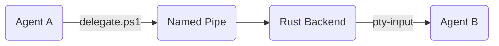

# 🛰️ DidiTerminal
### The Autonomous Multi-Agent Orchestrator Terminal

DidiTerminal is a high-performance Windows-first desktop application designed for seamless, autonomous coordination between multiple AI agents. It transforms a standard terminal environment into a distributed "Agent OS" where specialized agents (Builders, Architects, Testers) collaborate on complex full-stack codebases with production-grade reliability.

---

## 🏗️ Core Architecture & Tech Stack

DidiTerminal is built with a state-of-the-art hybrid architecture that bridges high-level React UI with low-level Rust systems.

*   **Frontend:** React 19 + TypeScript + Vite + Tailwind CSS.
*   **Terminal Engine:** `xterm.js` with WebGL rendering for high-performance TUI support.
*   **Backend Runtime:** Tauri 2.0 (Rust) providing native Windows API access.
*   **PTY Management:** `portable-pty` for spawning and controlling native PowerShell/CMD instances.
*   **Inter-Process Communication (IPC):** A custom **DidiBus** built on Windows Named Pipes (`\\.\pipe\agentbus`) using Tokio.
*   **Local AI Inference:** Integrated `llama-server` sidecar for private, local LLM execution.

---

## 🚀 Key Features

### 🧠 Autonomous Orchestration
- **The Didi Protocol:** Automated workspace scaffolding via `.didi/` directory, providing agents with standardized communication scripts.
- **Master Plan (`MASTER_PLAN.md`):** A shared, file-based state machine that ensures agents stay synchronized without burning tokens on long chat histories.
- **Context Hydration:** A token-efficient snapshot system (`.didi\context`) that feeds agents git status, directory trees, and plan progress.

### 🛡️ Reliability & Safety
- **Sentinel Watchdog:** A background monitor that detects hallucination loops or repetitive command failures, automatically injecting corrective prompts.
- **Time-Travel Rollbacks:** Integrated git-snapshotting that allows the human or the Orchestrator to "rewind" the entire workspace if an agent breaks the build.
- **Brainstorming Mode:** A multi-agent consensus protocol where specialized agents (e.g., Security, UI, Backend) debate a solution before execution.

### 🖥️ Advanced Tiling Interface
- **Dynamic Layout Engine:** Supports Vertical, Horizontal, and smart **Grid** tiling (automatically calculating 2x2, 3x2, etc., based on agent count).
- **Collapsible Workspace:** Sidebar and terminal panes are fully resizable and collapsible to maximize focus.
- **Agent Handoff Feed:** Real-time visibility into the "thoughts" and task delegations happening across the DidiBus.

---

## 📖 Step-by-Step Tutorial

### 1. Setup & Launch
- Clone the repository and install dependencies using `npm install`.
- Launch the application with `npm run tauri dev`.
- Ensure **PowerShell** is installed, as DidiTerminal is optimized for Windows-native automation.

### 2. Initializing a Workspace
- Click the **Folder Icon** in the sidebar to select your project directory.
- Click **"Init Didi Protocol"**. This scaffolds the `.didi/` directory which contains the secret sauce:
  - `delegate.ps1`: The bridge to the IPC bus.
  - `context.ps1`: Automated context gathering for agents.
  - `MASTER_PLAN.md`: The shared state file for task tracking.

### 3. Spawning Your Team
- Use the **"+"** button or the input field at the bottom of the sidebar to create new agents.
- **Pro Tip:** Give them specialized names like `Architect`, `Builder`, `UI-Designer`, or `Tester`. DidiTerminal automatically assigns them unique PTY instances.

### 4. The Delegation Loop
- Start a task in the **Main Terminal**.
- When an agent needs help, it can run:
  ```powershell
  .didi\delegate Builder "Create a React component for the login page."
  ```
- The **DidiBus** will instantly route this task to the `Builder` agent. You'll see the handoff appear in the **Network Graph** and the **Activity Feed**.

### 5. Mastering the Brainstorm
- Stuck on a complex architectural decision? Click the **Brain** icon.
- Select your participants and describe the problem.
- Watch as your agents debate in real-time. Once they reach a consensus, the result is automatically appended to your `MASTER_PLAN.md`.

### 6. Safety with Sentinel & Time-Travel
- **Sentinel:** Keep the **Shield** icon active. If an agent enters a hallucination loop or fails a command repeatedly, Sentinel will automatically intervene, pause the agent, and inject a corrective prompt.
- **Snapshots:** Every time a task is delegated, DidiTerminal takes a git snapshot. If an agent goes rogue and deletes files, use the **Snapshot Panel** to "Rewind" the workspace to a known good state.

---

## 💡 Best Practices

- **Atomic Tasks:** Keep delegated tasks small and specific.
- **Plan First:** Always update the `MASTER_PLAN.md` before starting a major feature. Agents can read this file to understand the "Big Picture."
- **Context is King:** Use `.didi\context` within your prompts to feed agents the latest directory structure and git status.
- **Grid Layout:** When running 4+ agents, switch to **Grid Layout** (Grid icon) for the best visual overview of the entire team.

---

## ⚡ Developer Setup

### Prerequisites
- Node.js (v18+)
- Rust (stable)
- Windows (Optimized for PowerShell)

### Development
```bash
# Install dependencies
npm install

# Run the app in development mode
npm run tauri dev
```

### Building for Release
```bash
npm run tauri build
```

---

## 🛰️ The Didi Protocol IPC
The core of the system is the **DidiBus**. 
1. **Sender:** Runs `delegate.ps1`, which writes a JSON payload to `\\.\pipe\agentbus`.
2. **Rust Backend:** A background Tokio thread listens on the pipe, logs the event, and emits a Tauri event.
3. **Frontend:** React catches the event and writes the payload directly into the `stdin` of the target Xterm instance.



---

## 🚀 Future Roadmap

- **📸 Autonomous UI Vision:** Integrated headless browser snapshots for real-time UI/UX debugging.
- **🧬 Codebase-Wide RAG:** Local vector database for semantic search and long-term memory.
- **🏢 DidiCloud Bridge:** Extending the DidiBus over WebSockets for remote GPU coordination.
- **🛡️ Sandboxed Execution:** Docker/WASM isolation for high-risk code execution.
- **🎤 Voice Command Overlay:** Natural language control for the human orchestrator.
- **📦 Didi Skill Marketplace:** Standardized `.didi/skills` registry for DevOps tasks.

